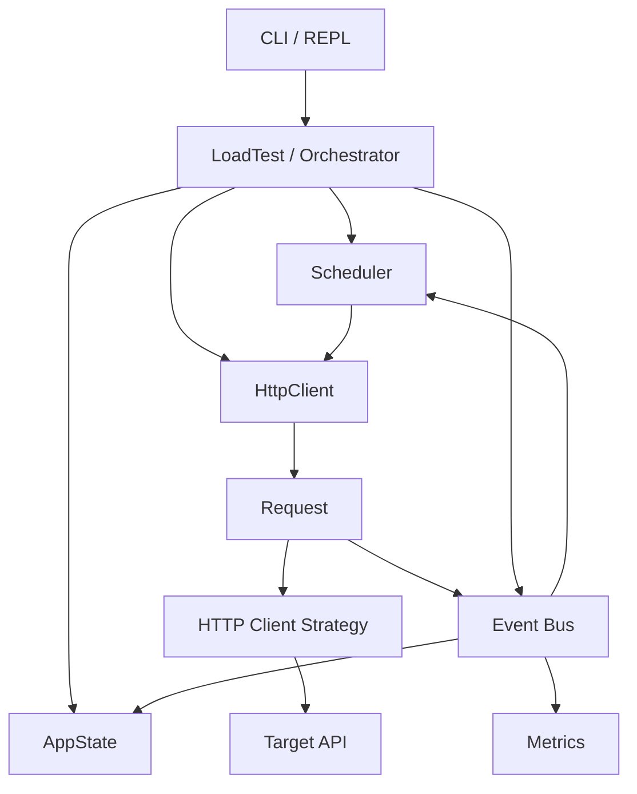

# loadXN

```md
[](LICENSE)
[](https://nodejs.org/)
[](https://github.com/olutobiogunsola/loadXN/stargazers)
[](https://github.com/olutobiogunsola/loadXN/issues)
```

A programmable HTTP load generator designed to generate controlled workloads and analyze system behavior under load.

loadXN provides configurable **request-rate control, concurrency limits, load scheduling, request lifecycle tracking, and latency analysis**. It is designed around the same fundamental concerns involved in building reliable distributed systems and performance-testing infrastructure.

The project focuses on making workload generation **measurable and controllable**, while exposing how changes in request rate, concurrency, latency, and system capacity affect one another.

> **Status:** Active development

---

## Key Capabilities

- Configurable HTTP request generation
- Target requests-per-second control
- Maximum concurrent request control
- Event-driven request lifecycle management
- Constant-rate workload generation
- Planned ramp-up, spike, and soak workloads
- High-resolution request latency measurement
- P50, P90, P95, and P99 latency analysis
- Per-second request-start metrics
- CSV request-level output
- Aggregate test reporting
- Pluggable HTTP client strategies

---

## Architecture



### Components

#### LoadTest

Coordinates the lifecycle of a load test and composes the scheduler, application state, HTTP client, and metrics components.

#### Scheduler

Controls request dispatch based on:

- Target request rate
- Elapsed test time
- Available concurrency
- Test lifecycle

The scheduler deliberately separates **arrival-rate demand** from **concurrency capacity**.

#### AppState

Maintains operational state including:

- Lifecycle state
- Active requests
- Total requests started
- Total requests completed
- Target request rate
- Maximum concurrency
- Test duration

Lifecycle:

```text
CREATED
   ↓
RUNNING
   ↓
STOPPING
   ↓
STOPPED
```

#### HttpClient

Provides the request-generation interface and delegates actual HTTP execution to a configurable client strategy.

#### Request

Represents the lifecycle of an individual HTTP request.

A Request records:

- Start timestamp
- End timestamp
- Duration
- Response status
- Error information

Request lifecycle events are emitted when a request starts and completes.

#### Event Bus

Provides decoupled communication between components.

Current events include:

```text
requestStarted
requestCompleted
testCompleted
```

This allows state management, scheduling, and metrics collection to react independently to request lifecycle changes.

#### Metrics

Collects request-level measurements and produces aggregate performance statistics.

Current measurements include:

- Total requests
- Request-start rate
- P50 latency
- P90 latency
- P95 latency
- P99 latency
- Maximum latency
- Response codes
- Request errors

---

## Installation

### Prerequisites

- Node.js
- npm
- A target HTTP endpoint

Verify your environment:

```bash
node --version
npm --version
```

### Clone

```bash
git clone <repository-url>
cd loadXN
```

### Install dependencies

```bash
npm install
```

---

## Usage

The load-test configuration currently consists of three primary parameters:

```js
const DURATION = 20000;
const RATE = 3000;
const MAX_CONCURRENCY = 5500;
```

| Parameter | Description |
|---|---|
| `DURATION` | Maximum test duration in milliseconds |
| `RATE` | Target request-start rate in requests/second |
| `MAX_CONCURRENCY` | Maximum number of in-flight requests |

Run the application using the current entry point:

```bash
node .
```

or:

```bash
npm start
```

> The CLI/REPL interface is under active development and will eventually expose these controls directly rather than requiring configuration changes.

---

## Example: Basic Load Test

```js
const DURATION = 10000;
const RATE = 100;
const MAX_CONCURRENCY = 50;
```

This configures:

```text
Duration:           10 seconds
Target rate:        100 req/s
Maximum concurrency: 50
```

The test attempts to generate traffic at the configured rate while preventing more than 50 requests from being simultaneously in flight.

---

## Example: High-Throughput Test

```js
const DURATION = 30000;
const RATE = 3000;
const MAX_CONCURRENCY = 1500;
```

This configuration requests:

```text
3,000 req/s
for 30 seconds
with a maximum of 1,500 concurrent requests
```

This type of workload can reveal the point at which increasing concurrency stops improving throughput and instead causes latency to increase.

---

## Example: High-Concurrency Test

```js
const DURATION = 20000;
const RATE = 3000;
const MAX_CONCURRENCY = 5500;
```

This configuration intentionally allows a large number of in-flight requests.

It can be used to examine the relationship between:

```text
Request Rate
      ↓
Concurrency
      ↓
Latency
      ↓
Throughput
      ↓
System Capacity
```

---

## Rate and Concurrency

Rate and concurrency represent different dimensions of workload generation.

### Request rate

```text
RATE = 3000
```

means the scheduler attempts to start approximately:

```text
3,000 requests/second
```

### Concurrency

```text
MAX_CONCURRENCY = 5500
```

means:

```text
At most 5,500 requests
may be in flight simultaneously.
```

If:

```text
MAX_CONCURRENCY = 5500
ACTIVE_REQUESTS = 5499
```

then:

```text
AVAILABLE_CONCURRENCY = 1
```

The scheduler cannot dispatch more than one additional request regardless of the amount of outstanding rate demand.

This separation is fundamental to understanding load generation.

---

## Scheduling Model

The scheduler evaluates two constraints:

```text
              Target Rate
                  │
                  ▼
            Rate Demand
                  │
                  ▼
        Available Concurrency
                  │
                  ▼
           Dispatch Count
                  │
                  ▼
             HTTP Client
```

Conceptually:

```js
const dispatchCount = Math.min(
    rateDemand,
    availableConcurrency
);
```

This allows the load generator to distinguish between:

- **Demand:** how much traffic the workload specifies
- **Capacity:** how much traffic can currently be in flight

When the target system becomes slower, active requests remain in flight longer. As concurrency approaches the configured ceiling, the generator's achievable request-start rate can fall below the configured target.

That behavior is observable rather than hidden.

---

## Little's Law

loadXN provides a practical environment for observing the relationship described by Little's Law:

```text
L = λW
```

Where:

```text
L = average number of requests in the system
λ = arrival rate
W = average time in the system
```

For example:

```text
Arrival rate = 3,000 req/s
Average latency = 0.5s

L ≈ 3,000 × 0.5
L ≈ 1,500 concurrent requests
```

As latency increases, maintaining the same arrival rate requires proportionally more concurrency.

This provides a useful framework for interpreting load-test results.

---

## Metrics

Example output:

```text
Requests   ::::::::::  15923
Throughput ::::::::::  810.52 requests/second
Runtime    ::::::::::  20 seconds

REQUESTS_STARTED_PER_SECOND
[3000,1072,1681,815,1078,855,,,,398,874,786,876,696,1057,409,686,487,630,523]

Latency

P50        :::::::::   5002.78 ms
P90        :::::::::   14187.54 ms
P95        :::::::::   14549.91 ms
P99        :::::::::   15098.99 ms
max        :::::::::   15269.11 ms
```

The per-second request-start distribution provides visibility into the stability of the generated workload.

For example, a workload configured for:

```text
3,000 req/s
```

but producing highly variable per-second rates indicates that the generator or target system is unable to maintain the requested arrival pattern.

---

## Latency Percentiles

loadXN reports latency percentiles rather than relying only on average latency.

### P50

The median request latency.

50% of measured requests completed at or below this latency.

### P90

90% of requests completed at or below this latency.

### P95

95% of requests completed at or below this latency.

### P99

99% of requests completed at or below this latency.

Percentiles are important because averages can hide long-tail latency.

A system could have a reasonable average while a small but significant portion of requests experience substantially higher latency.

---

## Output

loadXN produces request-level and aggregate performance data.

### Request-level CSV

```csv
Duration,Message,Code
12.42,OK,200
18.31,OK,200
9.84,OK,200
```

This provides raw measurements that can be analyzed independently of the aggregate report.

### Aggregate report

The aggregate report currently includes:

- Total requests
- Runtime
- Request-start distribution
- P50
- P90
- P95
- P99
- Maximum latency

---

## Load Patterns

The scheduler is being extended to support several workload patterns.

### Constant

```text
3000 req/s
────────────────────────────
```

Maintains a fixed target arrival rate.

### Ramp Up

```text
500 → 1000 → 1500 → 2000 → 2500 → 3000
```

Gradually increases traffic to observe system behavior as load increases.

### Spike

```text
500 req/s
500 req/s
500 req/s
5000 req/s
5000 req/s
5000 req/s
```

Introduces a sudden increase in traffic.

### Soak

```text
1500 req/s
────────────────────────────────────────
```

Maintains sustained traffic for an extended period to observe long-running behavior.

---

## Engineering Focus

The project explores several systems-engineering concerns:

### Concurrency

Managing large numbers of simultaneous asynchronous operations without unnecessarily blocking execution.

### Scheduling

Translating an abstract workload definition into actual request dispatch decisions.

### Rate Control

Maintaining a target request arrival rate while accounting for available execution capacity.

### Backpressure

Handling situations where requests remain in flight longer than expected and available concurrency becomes constrained.

### Latency Distribution

Measuring not only typical latency but also tail behavior through percentile measurements.

### Resource Constraints

Understanding how concurrency, latency, sockets, CPU, memory, network capacity, and target-system limits affect achievable throughput.

### Observability

Exposing enough information about the generated workload and request behavior to diagnose system performance.

---

## Design Decisions

### Event-driven request lifecycle

Requests emit lifecycle events instead of directly modifying application state.

```text
Request
   │
   ├── requestStarted
   │
   └── requestCompleted
```

State, Scheduler, and Metrics subscribe to these events.

This reduces coupling between the components responsible for execution, state management, scheduling, and measurement.

---

### Monotonic request timing

Request duration is measured using `performance.now()`:

```js
const start = performance.now();

// HTTP operation

const end = performance.now();

const duration = end - start;
```

This provides a monotonic clock appropriate for elapsed-time measurement.

---

### Separation of rate and concurrency

Rate represents workload demand.

Concurrency represents the maximum amount of work allowed to remain in flight.

Keeping these concepts separate allows the system to expose situations where:

```text
Requested Rate > Achievable Rate
```

rather than masking the limitation.

---

## Roadmap

### Request Engine

- [x] HTTP request execution
- [x] Request lifecycle
- [x] Concurrent requests
- [x] Request completion events

### Scheduler

- [x] Target request rate
- [x] Maximum concurrency
- [x] Basic scheduling
- [x] Rate/concurrency separation
- [ ] Improved rate-control algorithm
- [ ] Bounded catch-up behavior
- [ ] Token-bucket rate control

### Metrics

- [x] Request latency
- [x] P50
- [x] P90
- [x] P95
- [x] P99
- [x] Maximum latency
- [x] Per-second request-start tracking
- [ ] Error-rate metrics
- [ ] Completion-rate metrics
- [ ] Improved reporting

### Workload Patterns

- [ ] Constant
- [ ] Ramp-up
- [ ] Spike
- [ ] Soak
- [ ] Custom patterns

### Advanced

- [ ] Connection pooling
- [ ] Keep-alive behavior
- [ ] Request timeouts
- [ ] Backpressure controls
- [ ] Retry behavior
- [ ] Distributed load generation
- [ ] Multiple target hosts
- [ ] Advanced result visualization

---

## Project Status

**Active development.**

Current development is focused on improving scheduling accuracy and analyzing the relationship between:

```text
Requested Rate
       ↓
Actual Start Rate
       ↓
Active Concurrency
       ↓
Latency
       ↓
Achievable Throughput
       ↓
System Capacity
```

---

## License

MIT