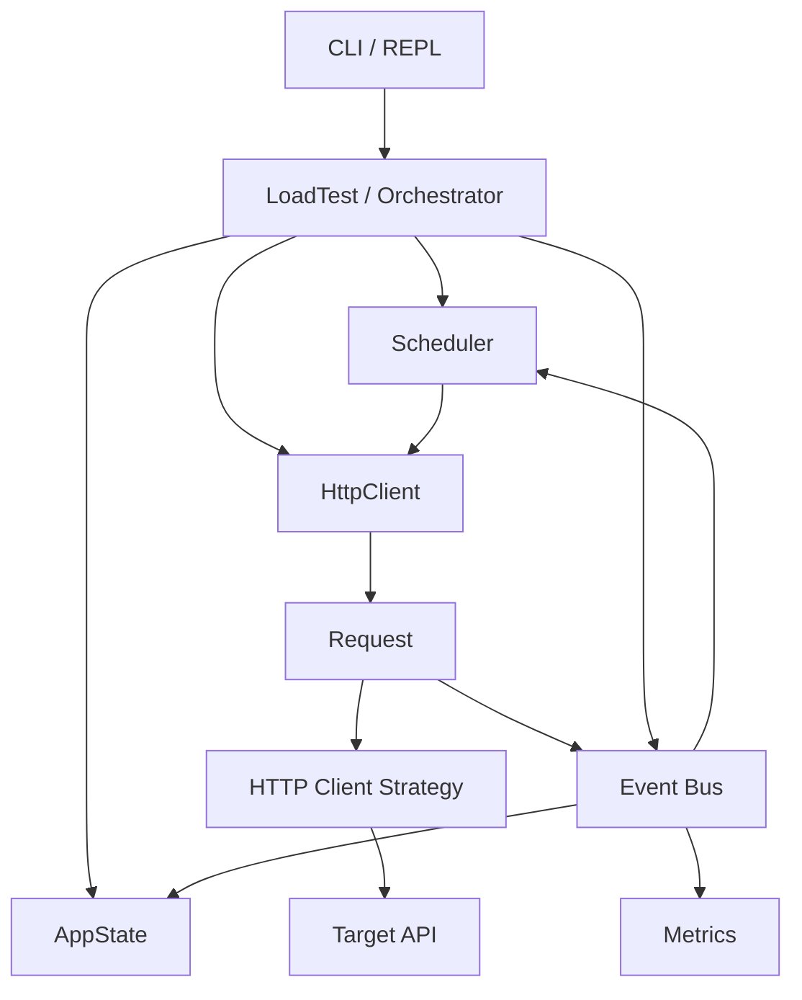

# loadXN

A lightweight HTTP load generator built with Node.js for learning and experimenting with **concurrency, request scheduling, rate control, latency measurement, and system behavior under load**.

> **Status:** Work in progress / learning project

---

## Why loadXN?

I built loadXN to understand what actually happens inside a load-testing tool rather than treating one as a black box.

The project focuses on the engineering problems involved in generating controlled HTTP traffic:

- How do you maintain a target request rate?
- How do you control concurrent requests?
- What happens when requests become slower than expected?
- How should a scheduler behave when concurrency is exhausted?
- How do you measure latency accurately?
- How do p50, p90, p95, and p99 differ from average latency?
- How does the relationship between throughput, latency, and concurrency emerge under load?

The project is intentionally being built from first principles.

---

## Installation

### Prerequisites

You need:

- Node.js
- npm
- A target HTTP endpoint to test

Check your Node.js and npm versions:

```bash
node --version
npm --version
```

### Clone the repository

```bash
git clone <repository-url>
cd loadXN
```

### Install dependencies

```bash
npm install
```

---

## Usage

> The CLI/REPL interface is currently under development. The examples below describe the current load-test configuration model.

A basic load test is configured with:

```js
const DURATION = 20000;        // milliseconds
const RATE = 3000;             // requests per second
const MAX_CONCURRENCY = 5500;  // maximum in-flight requests
```

This configuration means:

```text
Duration:           20 seconds
Target rate:        3,000 requests/second
Max concurrency:    5,500 requests
```

The target rate and maximum concurrency are independent controls.

### Basic example

For a relatively small test:

```js
const DURATION = 10000;
const RATE = 100;
const MAX_CONCURRENCY = 50;
```

This requests approximately:

```text
100 requests/second
for 10 seconds
with a maximum of 50 concurrent requests
```

Run the application using the project's current entry point:

```bash
node .
```

Or, if the project exposes an npm start script:

```bash
npm start
```

---

## Example: Low Load

A simple test can be used to validate the request engine:

```js
const DURATION = 10000;
const RATE = 10;
const MAX_CONCURRENCY = 5;
```

Expected workload:

```text
Target rate:       10 req/s
Duration:          10 seconds
Maximum in-flight: 5
```

This is useful for verifying that:

- Requests are being generated
- Requests complete correctly
- Request lifecycle events fire
- Latency is recorded
- Metrics are produced

---

## Example: Constant Load

To experiment with a constant workload:

```js
const DURATION = 30000;
const RATE = 1000;
const MAX_CONCURRENCY = 500;
```

This attempts to generate:

```text
1,000 requests/second
for 30 seconds
```

with no more than:

```text
500 concurrent requests
```

The actual start rate may be lower if the target system cannot process requests quickly enough.

---

## Example: High Concurrency

To investigate the relationship between latency and concurrency:

```js
const DURATION = 20000;
const RATE = 3000;
const MAX_CONCURRENCY = 5500;
```

This deliberately applies significant pressure to the target system.

The purpose isn't necessarily to achieve 3,000 req/s.

Instead, the test can reveal what happens when:

```text
Target Rate
     ↓
Request Latency increases
     ↓
More requests remain in flight
     ↓
Concurrency approaches its ceiling
     ↓
Available concurrency decreases
     ↓
Actual request-start rate falls
```

This is useful for studying system saturation and backpressure.

---

## Understanding the Configuration

### `DURATION`

How long the load test is allowed to run.

Specified in milliseconds.

```js
const DURATION = 20000;
```

Equivalent to:

```text
20 seconds
```

---

### `RATE`

The desired request arrival rate.

Specified in requests per second.

```js
const RATE = 3000;
```

This means loadXN attempts to start approximately:

```text
3,000 requests every second
```

It does **not** guarantee that the target will actually process 3,000 requests per second.

---

### `MAX_CONCURRENCY`

The maximum number of requests allowed to remain in flight simultaneously.

```js
const MAX_CONCURRENCY = 5500;
```

If:

```text
Maximum concurrency = 5,500
Active requests      = 5,499
```

then:

```text
Available concurrency = 1
```

The scheduler therefore cannot start more than one additional request at that moment.

---

## Example Output

A load test produces metrics similar to:

```text
Requests   ::::::::::  15923
Throughput ::::::::::  810.52 requests/second
Runtime    ::::::::::  20 seconds

REQUESTS_STARTED_PER_SECOND
[3000,1072,1681,815,1078,855,,,,398,874,786,876,696,1057,409,686,487,630,523]

Latency

P50        :::::::::   5002.78 ms
P90        :::::::::   14187.54 ms
P95        :::::::::   14549.91 ms
P99        :::::::::   15098.99 ms
max        :::::::::   15269.11 ms
```

The results show both the overall behavior of the test and the distribution of request latency.

---

## Interpreting Results

A configured rate is not necessarily the same as the observed rate.

For example:

```text
Configured rate:  3,000 req/s
Observed rate:      810 req/s
```

This does not automatically mean the scheduler failed.

The target system may be saturated.

A useful investigation is to compare:

```text
Requested Rate
Observed Start Rate
Active Concurrency
Latency
```

For example:

```text
Requested rate:       3000 req/s
Observed rate:         810 req/s
P50 latency:           5.0 seconds
P99 latency:          15.1 seconds
Max concurrency:      5500
```

These measurements can indicate that requests are remaining in flight for a long time and consuming available concurrency.

---

## Output

loadXN currently produces request-level and aggregate metrics.

Request-level data includes:

```text
Duration
Message
Response Code
```

Example CSV output:

```csv
Duration,Message,Code
12.42,OK,200
18.31,OK,200
9.84,OK,200
```

Aggregate reports include:

- Total requests
- Runtime
- Request-start distribution
- P50 latency
- P90 latency
- P95 latency
- P99 latency
- Maximum latency

---

## Why Build This Instead of Using k6/JMeter?

Production load-testing tools already exist and are considerably more mature.

loadXN is not intended to replace them.

The value of this project is understanding the mechanisms underneath them.

Building the scheduler, request engine, metrics collector, and lifecycle management from scratch makes concepts such as concurrency, backpressure, latency, and rate control concrete.

Once those concepts are understood, tools such as k6 or JMeter become easier to reason about rather than simply configure.

---

## Core Architecture



### Main components

#### LoadTest

The application orchestrator.

Responsible for coordinating the lifecycle of a load test and connecting the major components.

#### State

Maintains operational state such as:

- Current lifecycle state
- Active requests
- Total requests started
- Total requests completed
- Maximum concurrency
- Target request rate
- Test duration

Example lifecycle:

```text
CREATED
   ↓
RUNNING
   ↓
STOPPING
   ↓
STOPPED
```

#### Scheduler

Determines when and how many requests should be dispatched.

The scheduler considers two separate constraints:

```text
Target Rate
     +
Available Concurrency
     ↓
Requests to Dispatch
```

#### HttpClient

Responsible for generating and executing HTTP requests.

The client uses a strategy layer so different HTTP implementations can be swapped without changing the rest of the load generator.

#### Request

Represents an individual request lifecycle.

A request records:

- Start time
- End time
- Duration
- Response status
- Error information

#### Event Bus

Components communicate through events rather than tightly coupling themselves together.

Examples:

```text
requestStarted
requestCompleted
testCompleted
```

#### Metrics

Collects and analyzes historical request data.

Current metrics include:

- Total requests
- Request-start rate
- P50 latency
- P90 latency
- P95 latency
- P99 latency
- Maximum latency
- Request-level response information

---

## Scheduling Model

One of the main purposes of loadXN is to experiment with request scheduling.

The generator has two independent constraints.

### 1. Target rate

For example:

```text
RATE = 3000 requests/second
```

This represents the desired request arrival rate.

### 2. Maximum concurrency

For example:

```text
MAX_CONCURRENCY = 5500
```

This represents the maximum number of requests that may be in flight simultaneously.

The scheduler therefore considers:

```text
rate demand
     ↓
available concurrency
     ↓
dispatch count
```

Conceptually:

```js
dispatchCount = Math.min(
    rateDemand,
    availableConcurrency
);
```

---

## Little's Law

loadXN is also an experiment in understanding the relationship between:

- Throughput
- Latency
- Concurrency

Little's Law:

```text
L = λW
```

Where:

```text
L = average number of requests in the system
λ = arrival rate
W = average time in the system
```

For example, if a system processes approximately:

```text
3000 requests/second
```

with an average latency of:

```text
0.5 seconds
```

then the expected concurrency is approximately:

```text
3000 × 0.5 = 1500 concurrent requests
```

---

## Load Patterns

Planned load patterns include:

### Constant

Maintain a fixed target request rate.

```text
3000 req/s
────────────────────────
```

### Ramp Up

Gradually increase traffic.

```text
500 → 1000 → 1500 → 2000 → 2500 → 3000
```

### Spike

Suddenly increase traffic.

```text
500 req/s
500 req/s
500 req/s
5000 req/s
5000 req/s
5000 req/s
```

### Soak

Maintain sustained traffic for an extended period.

```text
1500 req/s
────────────────────────────────────────
```

---

## Design Decisions

### Event-driven request lifecycle

Requests emit lifecycle events rather than directly modifying global application state.

```text
Request
   │
   ├── requestStarted
   │
   └── requestCompleted
```

State and Metrics subscribe to these events.

---

### Monotonic timing

Request durations are measured using `performance.now()` rather than wall-clock timestamps.

Conceptually:

```js
start = performance.now();

...

end = performance.now();

duration = end - start;
```

---

### Concurrency is not rate

A system could receive:

```text
3,000 requests/second
```

while having relatively few requests in flight if latency is low.

Conversely, a slow system can accumulate thousands of concurrent requests while processing a much lower number of requests per second.

loadXN keeps these concepts separate.

---

## Current Limitations

loadXN is still under development.

Known limitations include:

- Scheduler behavior is still being refined
- Rate control is still evolving
- More load patterns are required
- HTTP configuration is still evolving
- Reporting is basic
- Error classification needs improvement
- Connection management needs further investigation
- Distributed load generation is not currently supported
- No GUI
- No advanced result visualization yet

---

## Roadmap

### Phase 1 — Request Engine

- [x] HTTP request execution
- [x] Request lifecycle
- [x] Concurrent requests
- [x] Request completion events

### Phase 2 — Scheduler

- [x] Target request rate
- [x] Maximum concurrency
- [x] Basic scheduling
- [x] Rate/concurrency separation
- [ ] Improved rate-control algorithm
- [ ] Bounded catch-up behavior
- [ ] Token-bucket experimentation

### Phase 3 — Metrics

- [x] Request latency
- [x] P50
- [x] P90
- [x] P95
- [x] P99
- [x] Maximum latency
- [x] Per-second request-start tracking
- [ ] Error-rate metrics
- [ ] Completion-rate metrics
- [ ] Better reporting

### Phase 4 — Load Patterns

- [ ] Constant
- [ ] Ramp-up
- [ ] Spike
- [ ] Soak
- [ ] Custom patterns

### Phase 5 — Advanced Experiments

- [ ] Connection pooling
- [ ] Keep-alive behavior
- [ ] Request timeouts
- [ ] Backpressure
- [ ] Rate limiting
- [ ] Retry behavior
- [ ] Distributed load generation
- [ ] Multiple target hosts

---

## What I'm Learning

The project is primarily an engineering exercise around:

- Event-driven architecture
- Concurrency
- Scheduling algorithms
- Asynchronous I/O
- Rate limiting
- Backpressure
- Connection management
- Latency distributions
- Percentile calculations
- Throughput
- Little's Law
- System saturation
- Resource constraints
- Observability
- Fault handling

The goal is not simply to produce a tool that sends HTTP requests.

The goal is to understand **why a system behaves the way it does under load**.

---

## Project Status

**Active development.**

The current focus is improving the scheduler and understanding the relationship between:

```text
Requested Rate
       ↓
Actual Start Rate
       ↓
Concurrency
       ↓
Latency
       ↓
System Capacity
```

---

## License

MIT